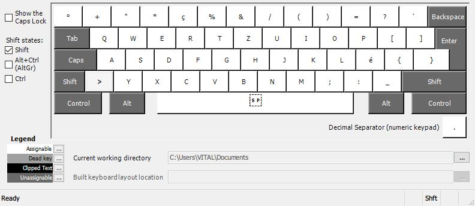
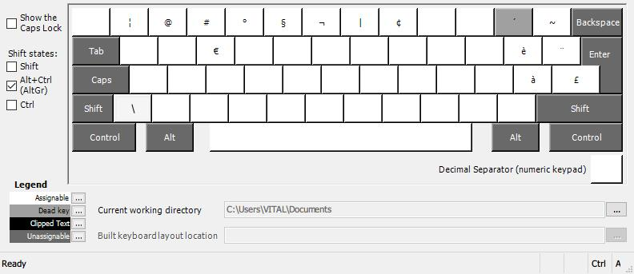

# Keyboard Layout Swiss German - Developer
An optimized keyboard mapping for the swiss german keyboard layout.
The mapping was based on the default swiss german layout and focuses on developer productivity.

## Default-Mapping

## Shift-Mapping

## AltGr-Mapping
